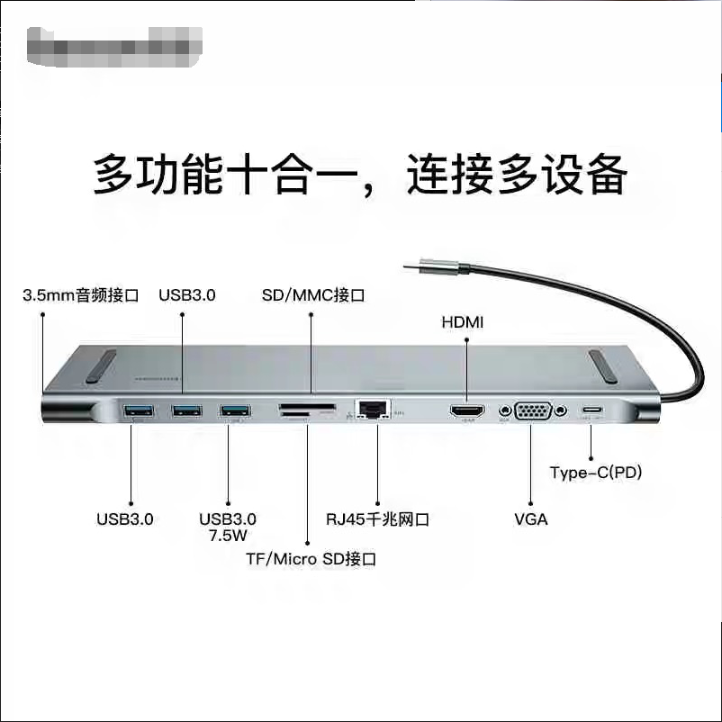
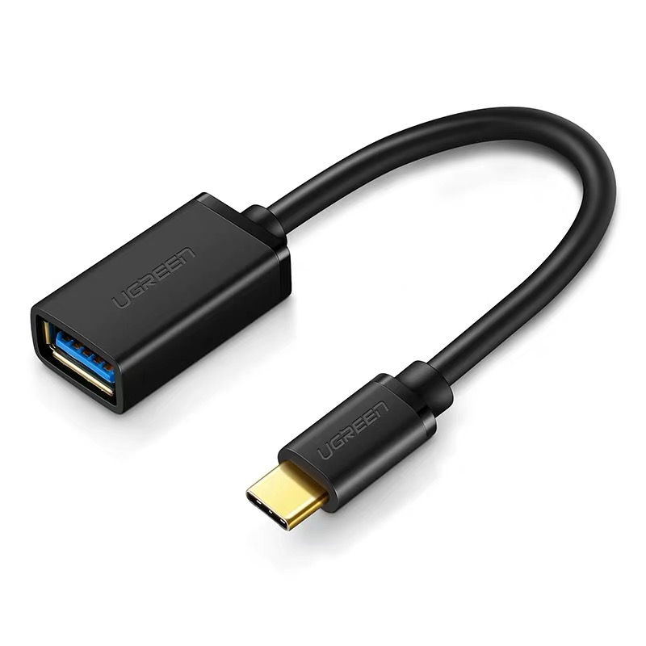
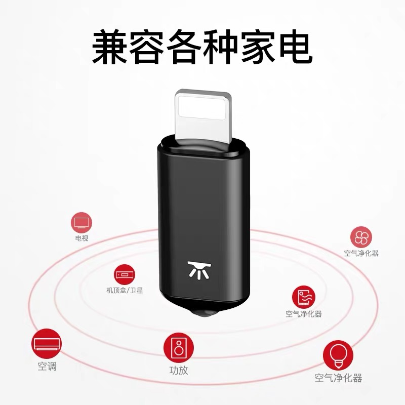
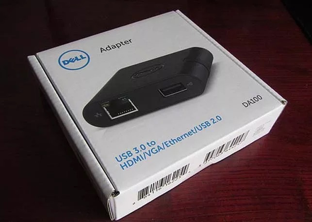
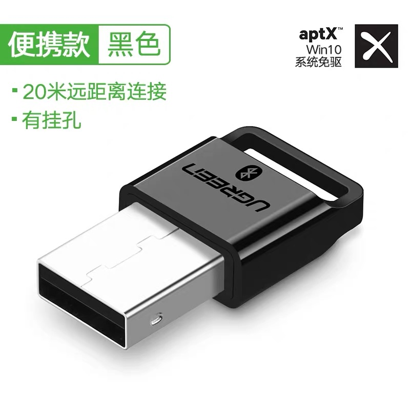
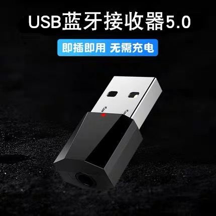
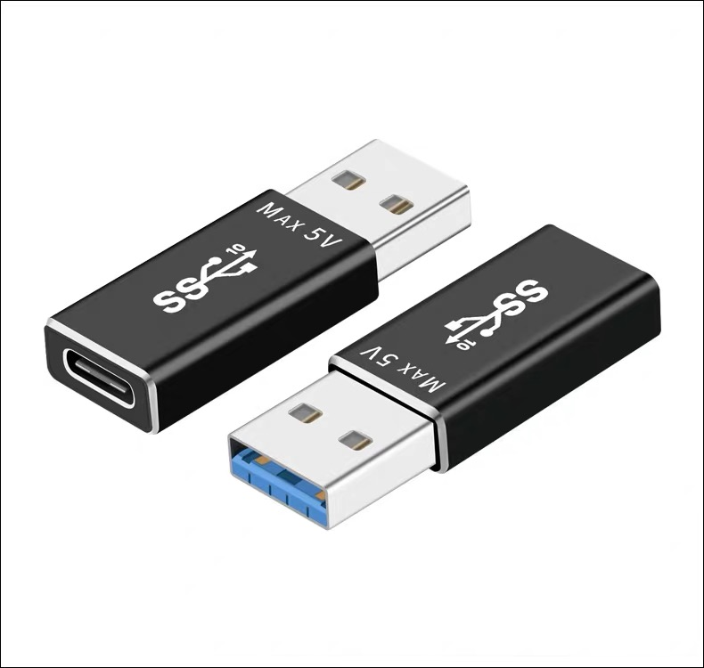

# Docking station

 * **You deserve a multi-functioning docking station to unlock your phone's full potential. The dock showed in the following picture has integrated most of the common ports and has full support of the kernel. For example, the built-in LAN port of this dock can scan the routers for wireless malfunction, sniff password from routers through PPPOE...... It can free you from loads of heavy equipments (strongly recommended).**

***
# Type-C to USB conversion cable

* **This cable is the best for pentest with single device(strongly recommended).**

***

# OTG IR remote module

* **All of the OnePlus phones come with no built-in IR module, so it's important to get it a good OTG IR transmitter. The kernel I built has enabled support for all kinds of IR modules, and of course you can simply use the corresponding apps to control the module. Just plug it in, go to Settings>>>System>>>enable OTG, then you can become the king of all remote household devices(strongly recommended).**

***

# DA100

* **The following photo is DELL DA100 USB 3.0 to HDMI/VGA/Ethernet/USB 2.0 utility converter. It's a little complicated for OnePlus 6/OnePlus 6t to connect to an exterior HDMI screen, (OnePlus 7/OnePlus 7 Pro can support this feature perfectly, please await while I try to transform the NetHunter kernel to these devices), for its Type-C port is actually running USB 2.0 protocol, and most docking stations cannot support this. Fortunately, thanks to the test conducted by XDA, now we know that only docks based on displaylink chips aligned with Displaylink Presenter app can make the HDMI screens work. Also you need to turn on OTG in the system setting, and disable the exterior PD power source. So, here I'd recommend this converter to anyone in need of this kind of devices. The video link is down below:**

* [oneplus1-oneplus6t HDMI  Test Video](https://www.youtube.com/watch?v=lm66kJ6HPvY)

* [oneplus7-oneplus7pro HDMI Test Video](https://www.youtube.com/watch?v=PgJ09Fzx7VA)

***

***
# USB Bluetooth receiver

* **The picture follow is an OTG Bluetooth module. The kernel supports Bluetooth devices perfectly, so you can test, debug, develop, or pentest with OTG Bluetooth modules. For example, Bluetooth D.Dos seems to be a good option ^_^.**

# In-car Bluetooth receiver

 * **In-car Bluetooth receiver with OTG feature. Plug it in speakers without Bluetooth function, and you can tap to them wirelessly. Great for speaker pranks ^=^.**

***

# Type-C to USB converter

* **Type-C to USB converter. The kernel supports external devices, so it's rather important to have a good Type-C to USB converter. This converter works with the dock as well.**

***

