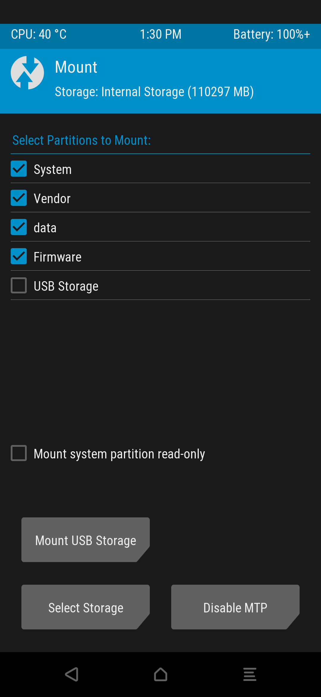
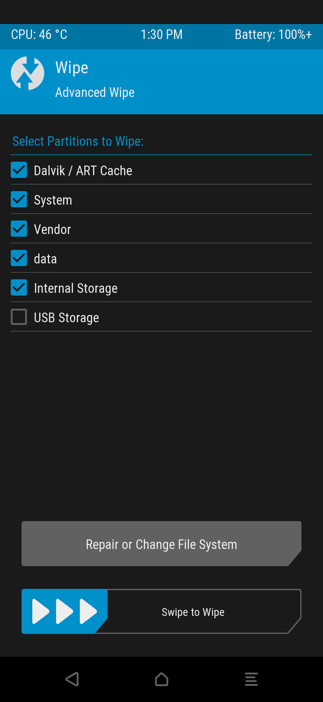
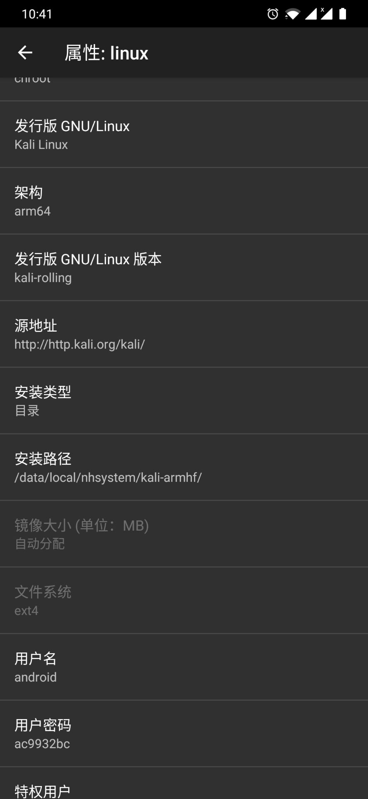
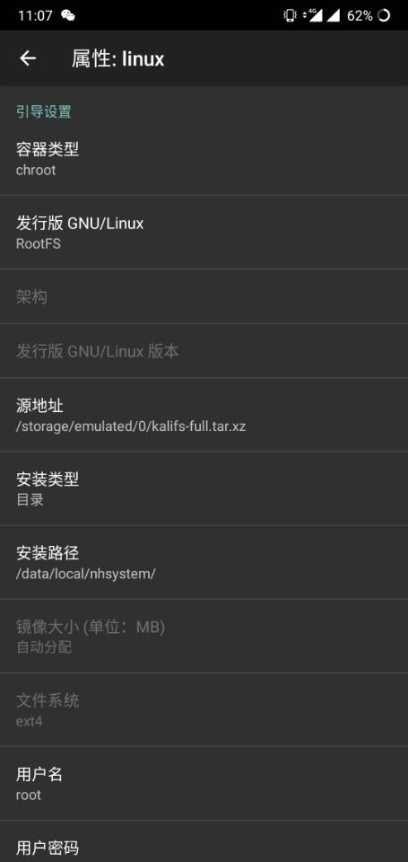
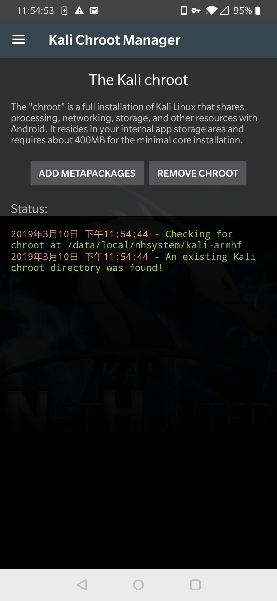

# 关于extract_android_ota_payload的依赖安装

**对于Linux系统类使用以下命令安装**

```
apt install python
apt install python-protobuf

```
**对于其他win系统或者在安装了python的系统并配置好环境上面使用以下命令安装**

```
pip install protobuf

```

# 关于adb 和fastboot下载

**对于普通Linux用户使用apt命令安装即可**

```
apt install adb

atp install fastboot

```

**对于其他用户请到Google官网下载**

* **[Windows](https://dl.google.com/android/repository/platform-tools-latest-windows.zip)**


* **[Mac](https://dl.google.com/android/repository/platform-tools-latest-darwin.zip)**

* **[Linux...](https://dl.google.com/android/repository/platform-tools-latest-linux.zip)**


# 下载ROM包

* **到下面以下官网下载Oxygen OS的系统.**

* **个人推荐使用Beta Buil(测试版)系统，因为他永远都是最新的功能。而且此内核包和各种调试也是基于Oxygen OS.但是内核也是支持HO2S的所以看你怎么选择**


* **[Oxygen OS 6T](https://www.oneplus.com/support/softwareupgrade/details?code=9)**

* **[Oxygen OS 6](https://www.oneplus.com/support/softwareupgrade/details?code=8)**


* **然后解压缩下载的压缩包提取payload.bin,使用以下命令提取系统img镜像**


```

python extract_android_ota_payload.py payload.bin out

```

* **接下来就可以在out文件夹看到所有的镜像了，然后根据自己的操作系统选择xxx.sh或者xxx.bat到out文件夹。然后选择适用于你手机的twrp(OP6 or OP6T)recovery.img镜像复制到out文件夹。shuaji.sh/.bat 默认是twrp-3.3.1-0-fajita-O6T.img 根据你需要选择修改**


# 其他选项

* **为保证干净完美的刷入内核。执行完以上相关操作后你可以根据以下选项来刷入干净的Oxygen OS系统**

**刷入twrp，然后在twrp里面挂载所有分区。然后选择Wipe勾选上所有分区，然后右滑点击清除**

```
fastboot boot twrp(OP6 or OP6T)recovery.img
```







**清除完成后。点击重启到System，然后他会自动进入bootloader模式。接着执行以下操作刷入系统**

```
Windows 双击out 文件夹里面的flash.bat

Linux  bash out 文件夹里面的flash.sh

```

**刷完之后。在安装magisk.zip,然后重启打开系统确认magisk已经正常安装**

```
1、 
点击 sideload

然后使用 adb sideload magisk-xxx-xxx.zip命令刷入magisk

重启到系统，确认已经正常安装好magisk

2、
adb push magisk-xxx-xxx.zip /sdcard

然后选择sdcard 点击 magisk-xxx-xxx.zip 安装

重启到系统，确认已经正常安装好magisk

```

**！！！如果你是国内用户，请在重启到系统的时候不要连接到WIFI或互联网，对于已经插入手机卡的用户建议拔掉手机卡。因为Oxygen OS会验证谷歌，国内用户由于无法访问谷歌，所以会卡在谷歌验证界面。切记！！！**


* **然后按照以下命令刷入内核即可**

```
打开usb调试模式执行 shuaji.sh or shuaji.bat

1、 
点击 sideload

然后使用 adb sideload DJY-Kernel-VXX.zip 命令刷入内核

重启到系统，查看内核确认已经正常安装好内核

2、
adb push DJY-Kernel-VXX.zip /sdcard

然后选择sdcard 点击 DJY-Kernel-VXX.zip安装

重启到系统，查看内核确认已经正常安装好内核

```

# Kali Chroot Install


* **
* **LInux Deploy 目录安装方式**




* **Linux Deploy Rootfs 安装方式**



***
* **Kali Nethunter APP 默认安装方式**

